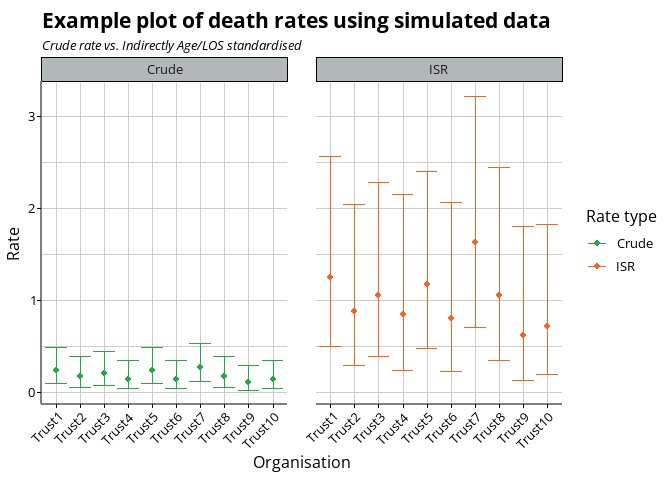
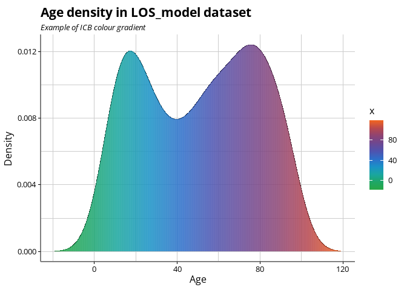

# BSOLutils

This repository contains an R package to help with various day-to-day
tasks in BSOL ICB BI and Data Science teams. It contains various helper
functions for things like:

- confidence intervals
- ICB colour palette functions
- ggplot2 and plotly helpers, themes and colour scales
- SQL conversion functions for estimating data types and lengths
- Dispersion ratios and overdispersion calculations
- Standardisation and inequality comparison ratios

This package is not released on CRAN, but can be installed from GitHub
using the following command:

``` r
# install.packages("remotes")
remotes::install_github("https://github.com/Birmingham-and-Solihull-ICS/BSOLutils")
```

# Examples

## Confidence interval calcualtions

We often calculate rates, ratios and standardised methods. We have,
broadly, followed PHE / UKHSA guidance on methods, with an exception for
using Ulm’s methods for standardised rates.

``` r
library(BSOLutils)
library(NHSRdatasets)
library(dplyr)
data("LOS_model")

#calculate crude and indirectly (Age and LOS) standardised rates (ISR)
model1 <- glm(Death ~ Age * LOS, data = LOS_model, family = "binomial")

# Use the predicted risk of death per patient from your model
LOS_model$risk_death <- predict(model1, newdata = LOS_model, type = "response")

# Summarise by organisation
LOS_summary <-
  LOS_model |> 
  group_by(Organisation) |> 
  summarise(Patients = n(),
            Deaths = sum(Death),
            Predicted_deaths = sum(risk_death))

# Add rate calculations
LOS_summary <-
  LOS_summary |> 
  mutate(Crude_Rate = Deaths / Patients,
         ISR_Rate = Deaths / Predicted_deaths)

# Calcualting in isolation
byars_ci(LOS_summary$Deaths, LOS_summary$Patients)
#>         Rate    LowerCI   UpperCI
#> 1  0.2333333 0.09348102 0.4807754
#> 2  0.1666667 0.05371159 0.3889388
#> 3  0.2000000 0.07303286 0.4353250
#> 4  0.1333333 0.03587168 0.3413584
#> 5  0.2333333 0.09348102 0.4807754
#> 6  0.1333333 0.03587168 0.3413584
#> 7  0.2666667 0.11482302 0.5254667
#> 8  0.1666667 0.05371159 0.3889388
#> 9  0.1000000 0.02009909 0.2921788
#> 10 0.1333333 0.03587168 0.3413584

exact_SMR_ci(LOS_summary$Deaths, LOS_summary$Predicted_deaths)
#>         Rate   LowerCI  UpperCI
#> 1  1.2425644 0.4995753 2.560158
#> 2  0.8745683 0.2839700 2.040951
#> 3  1.0480742 0.3846248 2.281216
#> 4  0.8385838 0.2284859 2.147108
#> 5  1.1651140 0.4684362 2.400580
#> 6  0.8034616 0.2189162 2.057181
#> 7  1.6297070 0.7035918 3.211172
#> 8  1.0475907 0.3401498 2.444727
#> 9  0.6153406 0.1268980 1.798286
#> 10 0.7128685 0.1942327 1.825226

# Adding in to a table
LOS_summary <-
  LOS_summary |> 
  mutate(Crude_LowerCI = byars_ci(Deaths, Patients)$LowerCI,
         Crude_UpperCI = byars_ci(Deaths, Patients)$UpperCI,
         ISR_LowerCI = exact_SMR_ci(Deaths, Predicted_deaths)$LowerCI,
         ISR_UpperCI = exact_SMR_ci(Deaths, Predicted_deaths)$UpperCI
  )
```

## SQL-helper functions

When loading data into SQL Server using R, we can rely on implicit
conversation but it is not always right. The function below takes and
data.frame input (for example the `mtcars` demo data) and suggests
suitable data types for SQL Server import.

``` r
derive_sql_data_types(LOS_model)
#> Warning in .f(.x[[i]], ...): No SQL mapping defined for R class 'ordered'.
#> Using varchar(max).
#>             ID   Organisation            Age            LOS          Death 
#>          "int" "varchar(max)"          "int"          "int"          "int" 
#>     risk_death 
#>        "float"
```

## Colour palettes and themes

Colour palettes and associated function for `ggplot2` are included. The
default is set to the new, clustered ICB graphic. There are other
palettes, based off the old BSOL ICB styling and style guide colours,
including hue-based single colour palettes.

Plotting the standardisation example from above, we;ll aply both the ICB
colour scale and the ICB theme.

``` r
library(ggplot2)
library(tidyr)
library(stringr)

# First pivot it round for easy plotting.
LOS_summary |> 
  pivot_longer(
    cols = matches("^(Crude|ISR)_(Rate|LowerCI|UpperCI)$"),
    names_to = c("Rate_type", ".value"),
    names_sep = "_"
  ) %>%
  select(Organisation, Rate, Rate_type, LowerCI, UpperCI, everything()) |> 
  ggplot(aes(x = Organisation, colour = Rate_type, y = Rate)) +
  geom_point() +
  geom_errorbar(aes(ymax = UpperCI, ymin = LowerCI)) +
  facet_grid(~Rate_type, scales = "free_y") +
  scale_colour_icb() +
  labs(title = "Example plot of death rates using simulated data",
       subtitle = "Crude rate vs. Indirectly Age/LOS standardised",
       colour = "Rate type") +
  theme_icb() +
  theme(axis.text.x = element_text(angle = 45, hjust = 1))
```



Using a colour gradient:

``` r
# Create a density object
Age_density <- density(LOS_model$Age, n = 2 ^ 12)

ggplot(data.frame(x = Age_density$x, y = Age_density$y),
       aes(x = x, y = y)) +
  geom_line() + 
  geom_segment(aes(xend = x, yend = 0, colour = x), alpha = 0.2) +
  {{scale_colour_icb(discrete = FALSE)}} +
  labs(title = "Age density in LOS_model dataset",
       subtitle = "Example of ICB colour gradient",
       x = "Age",
       y = "Density") +
  {{theme_icb()}}
```



## Date functions

We often work with dates, which can be a bit cumbersome in `R`. These
functions perform common transformations of dates:

Generating a sequence of years:

``` r
generate_year_series(2014, 2024, 3)
#>   from   to k
#> 1 2014 2016 3
#> 2 2015 2017 3
#> 3 2016 2018 3
#> 4 2017 2019 3
#> 5 2018 2020 3
#> 6 2019 2021 3
#> 7 2020 2022 3
#> 8 2021 2023 3
#> 9 2022 2024 3
# Non-overlapping sequence
generate_year_series(2014, 2024, 3, overlapping = FALSE)
#>   from   to k
#> 1 2014 2016 3
#> 2 2017 2019 3
#> 3 2020 2022 3
```

Functions for pulling out the financial year, e.g. 2025/25 for 30th
April 2025.

``` r
f_year(Sys.Date())
#> [1] "2025/26"

f_year_start(Sys.Date())
#> [1] "2025-04-01"
f_year_end(Sys.Date())
#> [1] "2026-03-31"
```

## Dispersion

Dispersion is the ‘variance’ of poisson or binomial models, where
‘overdispersion’ is common because real-world data shows more
variability than Poisson or binomial models expect. We can test for it
using by calculating the dispersion ratio, and we can calculate
‘between’ variance to pair with ‘within’ variance in random-intercept
type models.

``` r
# The dispersion ratio of the model above:
disp_ratio(model1)
#> [1] 1.13377

# 1.13377 is not really overdispersed (1 = equidispersion)

# Calculate the dispersion ratio of a series of z-scores
phi <- phi_func(6, c(1.3,0.75, 1.5, 2, -1.2, -2.2))

phi
#> [1] 2.46375
```

# Licence

This repository is dual licensed under the [Open Government v3](NA) &
MIT. All code and outputs are subject to Crown Copyright.


